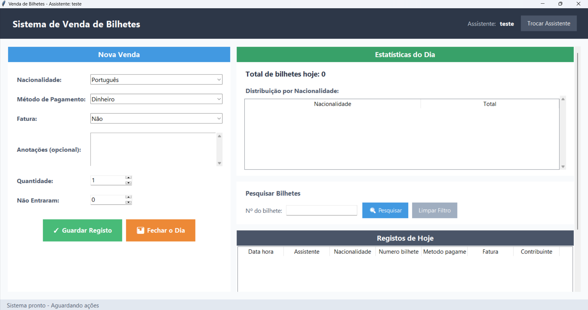

# 🎟️ Ticket Sales Management System

A lightweight and efficient desktop application designed to manage ticket sales, track daily revenue, and generate reports.

---

## 🚀 Overview

This application was built to simplify ticket sales operations, providing an intuitive interface for managing transactions, monitoring performance, and exporting reports.

> ⚠️ The full source code is currently private. This repository is intended to showcase the application's features and interface.

---

## 🧩 Features

* 💰 Register ticket sales in real-time
* 📊 Daily statistics and performance tracking
* 🧾 Automatic report generation (Excel)
* 🔐 User authentication system
* 💾 Automatic backup system
* 📅 End-of-day closing functionality

---

## 🖥️ Screenshots

### Main Interface

### Sales Panel

### Reports

---

## 🛠️ Tech Stack

* Python
* Tkinter (GUI)
* SQLite (Database)
* Pandas (Data processing)
* ReportLab (PDF generation)

---

## 🧠 Key Highlights

* Focus on simplicity and usability
* Offline-first application
* Designed for small-scale event management
* Efficient data handling and reporting

---

## 📌 Use Cases

* Small festivals
* Local ticket-based events

---

## 📬 Contact

If you're interested in the project, feel free to reach out!

---

## ⭐ Acknowledgments

Developed as part of a personal project for real life use.
